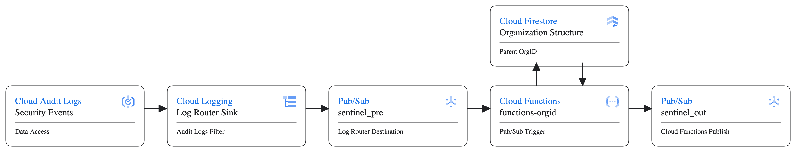

## Functions OrgId inclusion


This is an code example on how to use Google Cloud Functions to enrich Audit logs with OrgId. 

# Architecture



# Prerequisites

1. Python and terraform knowledge
2. Terraform installed
3. Google Cloud account
4. Google Cloud Project
5. Enough permissions to run the terraform script and the resources included in the script


## How to use this repo

1. Clone the repository
```shell
git clone https://github.com/gbassan-br/functions-orgid.git
```
2. Alter the terraform script to your needs, especially the filter variable for the log sink.

```terraform
filter = "<FILTER>"
```

3. Run terraform script

```shell
cd terraform/
terraform init
terraform apply
``` 
4. Specify the terraform variables
    1. Organization (org)
    2. Google Cloud Project (project)
    3. Billing Account (acct)
    4. Region (region)

5. Observe the resources created by terraform

6. Check the Cloud Functions log to see if audit logs are being processed by the function

